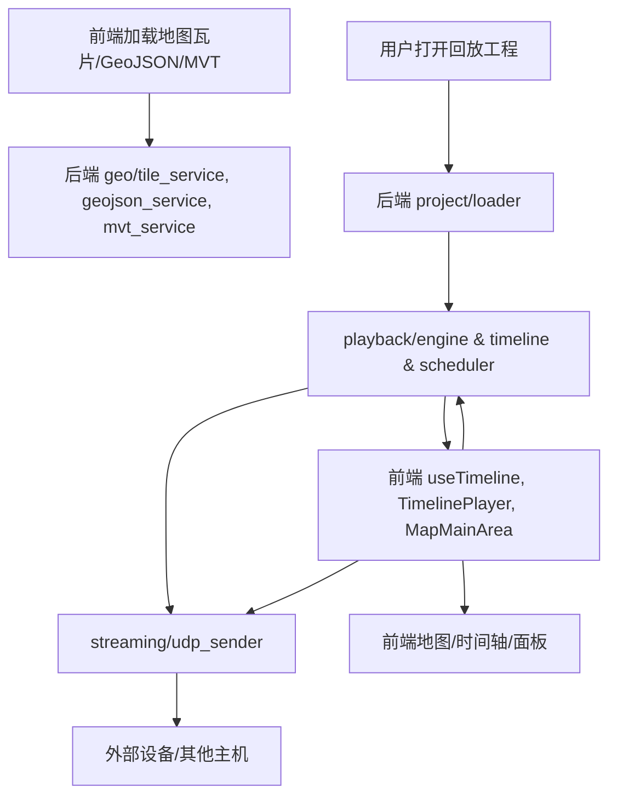

# CLAUDE.md

本文件为 Claude Code (claude.ai/code) 在本仓库协作开发时的架构与开发指南。

---

## 项目概述

本项目是一个基于 Tauri + Nuxt.js 的桌面级 PCAP 回放引擎，支持网络数据包的可视化回放，具备时间轴、地图、回放控制、工程管理等多种功能面板。

---

## 架构总览

### 前端
- 框架：Nuxt 3.17.6 + Vue 3.5.17
- 样式：Tailwind CSS（@nuxtjs/tailwindcss）
- UI组件：@nuxt/ui 统一设计体系
- 地图：MapLibre GL 地理可视化
- 构建工具：Vite
- SSR：关闭，仅SPA

### 后端
- 核心：自研 PCAP 处理库 pcap-io（src-tauri/crates/pcap-io）
- IPC：Tauri 命令系统，前后端通信
- 异步：Tokio 运行时
- 错误处理：thiserror 自定义错误类型

---

## 目录结构

```
playback-engine/
├── src-tauri/                    # 后端 (Rust/Tauri)
│   ├── src/
│   │   ├── api/                  # Tauri命令接口
│   │   ├── playback/             # 回放引擎
│   │   ├── streaming/            # 网络流服务
│   │   ├── geo/                  # 地理数据服务
│   │   ├── project/              # 工程管理
│   │   ├── state/                # 全局状态管理
│   │   └── types/                # 类型定义
│   ├── crates/                   # 独立核心库
│   │   └── pcap-io/              # PCAP处理库
│   └── Cargo.toml               # Rust配置
├── components/                   # 前端组件 (Vue/Nuxt)
│   ├── base/                     # 基础组件
│   ├── business/
│   │   ├── features/             # 业务功能模块
│   │   │   ├── map/              # 地图组件
│   │   │   ├── timeline/         # 时间轴组件
│   │   │   ├── panels/           # 功能面板
│   │   │   └── header/           # 顶部栏
│   │   └── layout/               # 布局组件
│   ├── display/                  # 展示组件
│   ├── input/                    # 输入组件
│   └── menu/                     # 菜单组件
├── composables/                  # 全局状态管理
├── types/                        # TypeScript类型定义
├── pages/                        # 页面路由
├── layouts/                      # 页面布局
├── assets/                       # 静态资源
└── public/                       # 公共文件
```

---

## 核心数据流



### 数据流说明
- 前端通过 API 请求地图瓦片、GeoJSON、MVT 数据，后端 geo 模块响应
- 用户通过工程管理面板选择/打开工程，后端 project/loader 解析工程结构
- 回放引擎 playback/engine 控制时间推进、调度数据包，向前端推送进度
- 前端组件负责进度显示、地图绘制、事件展示
- 回放数据通过 streaming/udp_sender 按配置发送到外部
- 前端可配置 UDP 发送参数，支持调试单个数据集

---

## 模块职责表

| 模块 | 职责/功能 | 技术栈/说明 |
|---|---|---|
| **geo/** | 地图数据服务 | 瓦片缓存、格式转换、API |
| **playback/** | 回放引擎/时间控制 | 事件调度、进度管理、状态同步 |
| **streaming/** | 网络流发送 | UDP广播/组播/单播、配置管理 |
| **project/** | 工程管理 | 多数据集PCAP处理、结构解析 |
| **state/** | 实时状态/配置同步 | 全局状态、回放/配置状态 |
| **api/** | Tauri命令接口 | 前后端通信、参数校验 |
| **components/** | 前端UI组件 | 地图、时间轴、面板、输入等 |
| **composables/** | 前端状态管理 | useProject, useTimeline等 |
| **types/** | 类型定义 | Rust/TS类型、协议结构 |

---

## 开发命令

### 前端开发
```bash
# 安装依赖
bun install

# 开发服务器
bun run nuxt:dev          # Web开发
bun run tauri:dev         # 桌面开发

# 生产构建
bun run nuxt:build        # Web构建
bun run tauri:build       # 桌面构建
```

### 代码质量
```bash
bun run format            # 格式化代码
bun run format:fix        # 格式化并修复
```

### 后端开发
```bash
cd src-tauri
cargo test                # 运行所有测试
cargo test test_name      # 运行指定测试
cargo bench               # 性能基准测试
cargo run --example name  # 运行示例
```

### 测试
- 前端：暂无专用测试框架
- 后端：Rust单元测试 `src-tauri/crates/pcap-io/tests/`
- 集成：大/小数据集、数据一致性测试

---

## 关键技术

- **PCAP处理**：自研pcap-io高性能数据包处理库
- **桌面应用**：Tauri v2 跨平台桌面
- **前端**：Nuxt 3 + Vue 3 Composition API
- **样式**：Tailwind CSS + 设计系统
- **地图**：MapLibre GL 地理可视化
- **状态**：Vue composables 响应式状态

---

## 重要说明

- SSR 关闭，仅SPA模式
- 自定义PCAP格式，性能优化
- Tauri命令自动初始化
- 跨平台支持Win/Linux/macOS

---

> 本文档持续更新，建议所有开发者优先查阅本文件以理解整体架构与开发规范。
