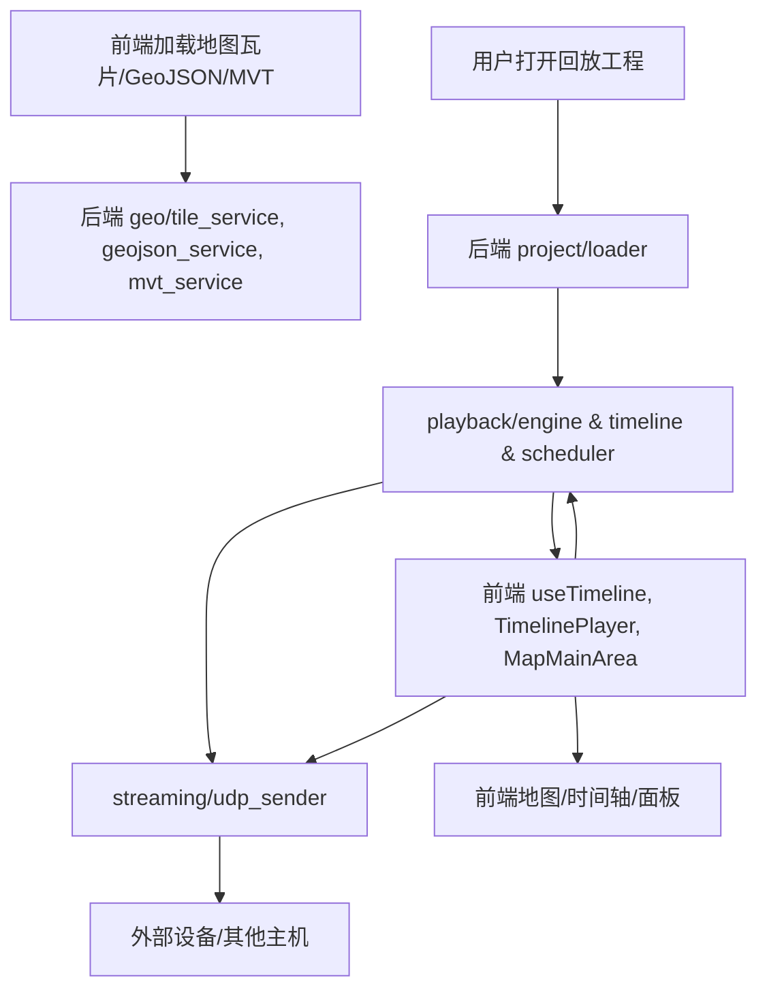

# CLAUDE.md

本文件为 Claude Code (claude.ai/code) 在本仓库协作开发时的架构与开发指南。

---

## 项目概述

本项目是一个基于 Tauri + Nuxt.js 的桌面级 PCAP 回放引擎，支持网络数据包的可视化回放，具备时间轴、地图、回放控制、工程管理等多种功能面板。

---

## 架构总览

### 前端

- 框架：Nuxt 3.17.6 + Vue 3.5.17
- 样式：Tailwind CSS（@nuxtjs/tailwindcss）
- UI组件：@nuxt/ui 统一设计体系
- 地图：MapLibre GL 地理可视化
- 构建工具：Vite
- SSR：关闭，仅SPA

### 后端

- 核心：自研 PCAP 处理库 pcap-io（src-tauri/crates/pcap-io）
- IPC：Tauri 命令系统，前后端通信
- 异步：Tokio 运行时
- 错误处理：thiserror 自定义错误类型

---

## 目录结构

```
playback-engine/
├── src-tauri/                    # 后端 (Rust/Tauri)
│   ├── src/
│   │   ├── api/                  # Tauri命令接口
│   │   ├── playback/             # 回放引擎
│   │   ├── streaming/            # 网络流服务
│   │   ├── geo/                  # 地理数据服务
│   │   ├── project/              # 工程管理
│   │   ├── state/                # 全局状态管理
│   │   └── types/                # 类型定义
│   ├── crates/                   # 独立核心库
│   │   └── pcap-io/              # PCAP处理库
│   └── Cargo.toml               # Rust配置
├── components/                   # 前端组件 (Vue/Nuxt)
│   ├── base/                     # 基础组件
│   ├── business/
│   │   ├── features/             # 业务功能模块
│   │   │   ├── map/              # 地图组件
│   │   │   ├── timeline/         # 时间轴组件
│   │   │   ├── panels/           # 功能面板
│   │   │   └── header/           # 顶部栏
│   │   └── layout/               # 布局组件
│   ├── display/                  # 展示组件
│   ├── input/                    # 输入组件
│   └── menu/                     # 菜单组件
├── composables/                  # 全局状态管理
├── types/                        # TypeScript类型定义
├── pages/                        # 页面路由
├── layouts/                      # 页面布局
├── assets/                       # 静态资源
└── public/                       # 公共文件
```

---

## 核心数据流



### 数据流说明

- 前端通过 API 请求地图瓦片、GeoJSON、MVT 数据，后端 geo 模块响应
- 用户通过工程管理面板选择/打开工程，后端 project/loader 解析工程结构
- 回放引擎 playback/engine 控制时间推进、调度数据包，向前端推送进度
- 前端组件负责进度显示、地图绘制、事件展示
- 回放数据通过 streaming/udp_sender 按配置发送到外部
- 前端可配置 UDP 发送参数，支持调试单个数据集

---

## 模块职责表

| 模块             | 职责/功能         | 技术栈/说明                  |
| ---------------- | ----------------- | ---------------------------- |
| **geo/**         | 地图数据服务      | 瓦片缓存、格式转换、API      |
| **playback/**    | 回放引擎/时间控制 | 事件调度、进度管理、状态同步 |
| **streaming/**   | 网络流发送        | UDP广播/组播/单播、配置管理  |
| **project/**     | 工程管理          | 多数据集PCAP处理、结构解析   |
| **state/**       | 实时状态/配置同步 | 全局状态、回放/配置状态      |
| **api/**         | Tauri命令接口     | 前后端通信、参数校验         |
| **components/**  | 前端UI组件        | 地图、时间轴、面板、输入等   |
| **composables/** | 前端状态管理      | useProject, useTimeline等    |
| **types/**       | 类型定义          | Rust/TS类型、协议结构        |

---

## 开发命令

### 前端开发

```bash
# 安装依赖
bun install

# 开发服务器
bun run nuxt:dev          # Web开发
bun run tauri:dev         # 桌面开发

# 生产构建
bun run nuxt:build        # Web构建
bun run tauri:build       # 桌面构建
```

### 代码质量

```bash
bun run format            # 格式化代码
bun run format:fix        # 格式化并修复
```

### 后端开发

```bash
cd src-tauri
cargo test                # 运行所有测试
cargo test test_name      # 运行指定测试
cargo bench               # 性能基准测试
cargo run --example name  # 运行示例
```

### 测试

- 前端：暂无专用测试框架
- 后端：Rust单元测试 `src-tauri/crates/pcap-io/tests/`
- 集成：大/小数据集、数据一致性测试

---

## 关键技术

- **PCAP处理**：自研pcap-io高性能数据包处理库
- **桌面应用**：Tauri v2 跨平台桌面
- **前端**：Nuxt 3 + Vue 3 Composition API
- **样式**：Tailwind CSS + 设计系统
- **地图**：MapLibre GL 地理可视化
- **状态**：Vue composables 响应式状态

---

## 重要说明

- SSR 关闭，仅SPA模式
- 自定义PCAP格式，性能优化
- Tauri命令自动初始化
- 跨平台支持Win/Linux/macOS

---

## 开发流程

本项目采用 SPECS 驱动开发方法，结合 EARS (Event-driven, Asynchronous, Reactive, Stateful) 规范进行需求分析和系统设计。

### 核心原则

#### 效率原则
- 并行执行优于顺序执行，识别可同时进行的任务
- 每个阶段输出最小可验证版本，避免过度设计
- 30分钟无进展即停止重新评估方法
- 所有交付物必须能独立部署运行

#### 质量原则
- 代码包含完整类型注解、文档注释，10分钟内可理解
- 零配置运行：一条命令即可启动，包含完整依赖
- 安全优先：输入验证、权限检查、数据保护
- 跨平台验证：Windows、macOS、Linux兼容或明确限制

#### 协作原则
- 技术术语配简要解释，确保理解一致
- 决策记录原因、备选方案、风险评估
- 问题报告包含：描述、复现、影响、解决方案
- 每次交流包含需求编号、设计章节、代码位置引用

### 工作流程

#### 阶段控制
每个阶段完成后停止工作，等待明确确认后进入下一阶段。

**需求触发词汇：** "我想要"、"需要实现"、"帮我做"、"创建"、"修改"、"增加功能"

**阶段门禁：**
- 需求→设计：需求文档完成，EARS格式验收标准编写完整
- 设计→实施：技术设计完成，架构图绘制，API设计定义
- 开始执行：任务拆分完成，依赖关系明确，工时估算完整

#### SPECS 驱动开发

采用需求、设计、实施三阶段结构化开发方法。

##### 需求收集与分析

**目标：** 将用户想法转化为完整需求文档

**执行标准：**
- 3轮对话内完成需求文档，避免无限询问
- 所有验收标准使用EARS格式（WHEN、IF、WHILE、WHERE）
- 用户故事包含角色、功能、价值三要素
- 文档位置：`.specs/{feature_name}/requirements.md`

**EARS 语法说明：**
- **普遍需求：** THE [系统名称] SHALL [系统响应]
- **事件驱动：** WHEN [触发事件] THE [系统名称] SHALL [系统响应]
- **状态驱动：** WHILE [持续条件] THE [系统名称] SHALL [系统响应]
- **可选特性：** WHERE [功能包含] THE [系统名称] SHALL [系统响应]
- **复杂需求：** WHEN [事件] AND IF [条件] THEN THE [系统名称] SHALL [响应]

##### 技术方案设计

**目标：** 基于需求创建详细技术设计

**执行标准：**
- 每个技术决策引用对应需求编号
- 包含系统架构图、组件设计、数据模型、API设计
- 说明技术选择原因和备选方案
- 详细错误分类、错误码、处理策略
- 覆盖单元、集成、端到端测试策略
- 文档位置：`.specs/{feature_name}/design.md`

##### 任务拆分与实施

**目标：** 转化为可执行编码任务

**执行标准：**
- 每个任务引用对应设计章节和需求编号
- 任务具体可在2-8小时完成，包含输入、输出、验收标准
- 按测试驱动开发组织：编写测试→实现功能→重构优化
- 使用DAG表示任务依赖，标注并行任务
- 包含工时估算，总工时不超过40小时
- 文档位置：`.specs/{feature_name}/tasks.md`

### 执行规则

#### 任务执行
1. 单任务原子性：每次执行一个任务，完成后立即停止等待确认
2. 上下文读取：执行前先读取requirements.md、design.md、tasks.md
3. 质量门禁：代码语法检查、单元测试通过、安全扫描、跨平台验证
4. 问题上报：技术困难、需求歧义、设计缺陷、安全风险时立即停止上报
5. 并行验证：开始前检查依赖关系，有可并行任务组一次性执行
6. 安全评估：检查用户输入、敏感数据、权限控制
7. 平台测试：系统调用、文件操作、网络访问在Windows环境验证

#### 质量控制

##### 需求审查检查清单
- [ ] 所有需求采用正确EARS格式
- [ ] 用户故事清晰明确，包含角色、功能、价值
- [ ] 验收标准具体可测试
- [ ] 覆盖所有功能和非功能性需求
- [ ] 约束条件明确定义

##### 设计审查检查清单
- [ ] 架构设计合理，组件职责清晰
- [ ] API设计符合RESTful原则
- [ ] 数据模型设计规范
- [ ] 错误处理策略完整
- [ ] 测试策略覆盖全面
- [ ] 安全和性能考虑充分
- [ ] 跨平台兼容性已考虑
- [ ] 代码质量要求已明确
- [ ] 并行开发可能性已评估

##### 任务审查检查清单
- [ ] 每个任务都是具体编码活动
- [ ] 任务间依赖关系清晰
- [ ] 任务粒度适中（2-8小时）
- [ ] 每个任务引用相关需求
- [ ] 包含充分测试任务
- [ ] 任务顺序符合开发最佳实践

> 本文档持续更新，建议所有开发者优先查阅本文件以理解整体架构与开发规范。
