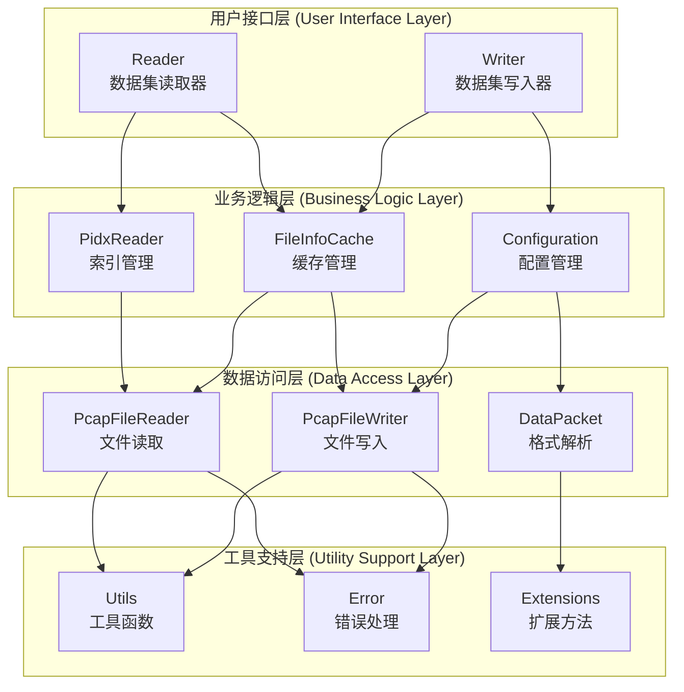
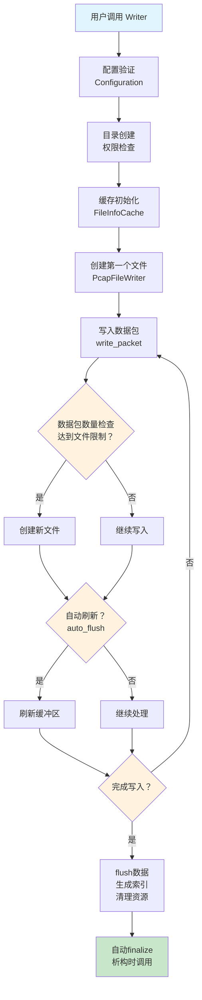
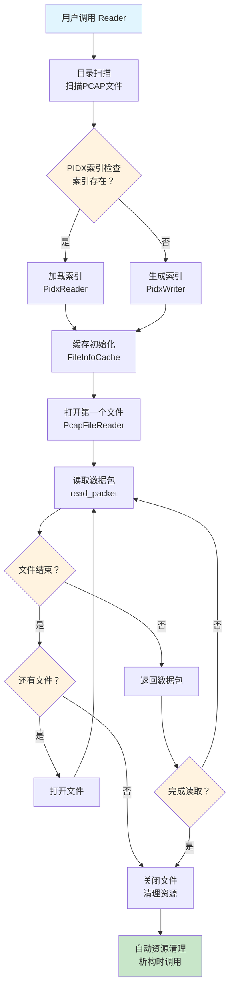
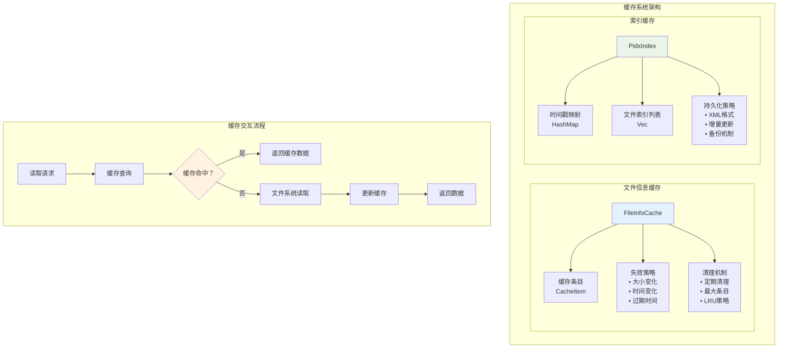
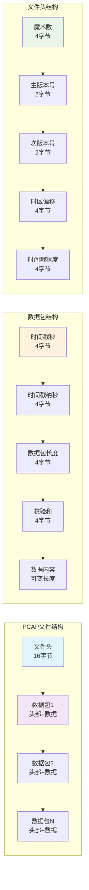

# PCAP-IO 模块内部设计文档

本文档详细描述了 pcap-io 模块的内部架构设计，包括索引系统、缓存机制、数据结构等核心组件的实现原理。

## 设计概述

### 核心设计理念

pcap-io 模块基于以下核心设计理念构建：

**高效数据组织**：优化的文件结构，支持高效数据访问和查询。

**灵活数据存储**：支持任意格式数据封装，适应多种应用场景。

**可扩展架构**：版本化设计确保协议可持续演进。

**跨平台兼容**：统一的数据表示确保不同系统间数据交换。

**接口简化**：减少冗余接口，提供更直观的API，提升用户体验。

### 模块架构层次

pcap-io 模块采用分层架构设计，主要包含以下几个核心层次：

| 层次 | 组件 | 职责 |
|------|------|------|
| 用户接口层 | Reader/Writer | 提供简洁的读写接口 |
| 业务逻辑层 | 索引管理、缓存管理 | 处理核心业务逻辑 |
| 数据访问层 | 文件读写、格式解析 | 底层数据操作 |
| 工具支持层 | 工具函数、错误处理 | 提供通用支持 |

### 架构图



## 整体业务流程

### Writer 生命周期

#### 初始化阶段

**配置验证**：验证 PcapConfiguration 参数的有效性，包括缓冲区大小、最大数据包数量等。

**目录创建**：检查并创建数据集目录，确保目录存在且具有写入权限。

**缓存初始化**：如果启用索引缓存，初始化 FileInfoCache 用于存储文件元数据。

#### 写入阶段

**文件管理**：当当前文件达到最大数据包数量限制时，自动创建新文件。

**数据包写入**：将数据包写入当前文件，包括头部和数据部分。

**校验和计算**：如果启用验证，自动计算并存储 CRC32 校验和。

**自动刷新**：根据配置决定是否自动刷新缓冲区到磁盘。

#### 文件切换逻辑

**触发条件**：当前文件数据包数量达到 `max_packets_per_file` 配置值。

**文件命名**：按照 `file_name_format` 配置生成新文件名。

**状态更新**：更新内部状态，包括文件路径、数据包计数等。

**缓存更新**：更新文件信息缓存中的相关条目。

#### 完成阶段

**数据刷新**：调用 flush 方法确保所有数据写入磁盘。

**索引生成**：如果启用索引功能，生成或更新 PIDX 索引文件。

**资源清理**：关闭文件句柄，清理内部状态。

**自动化finalize**：在析构时自动完成finalize操作，无需用户手动调用。

#### Writer 流程图



### Reader 生命周期

#### 初始化阶段

**目录扫描**：扫描数据集目录中的所有 PCAP 文件，按文件名排序。

**索引加载**：尝试加载 PIDX 索引文件，如果不存在则生成新索引。

**缓存初始化**：初始化文件信息缓存，提高后续读取性能。

**文件打开**：打开第一个 PCAP 文件，验证文件头格式。

**自动初始化**：在构造函数中自动完成所有初始化操作，无需用户手动调用。

#### 读取阶段

**数据包读取**：从当前文件读取数据包，包括头部解析和数据提取。

**校验和验证**：如果启用验证，验证数据包的 CRC32 校验和。

**文件切换**：当前文件读取完毕时，自动切换到下一个文件。

**缓存查询**：使用缓存避免重复的文件系统操作。

#### 文件切换逻辑

**触发条件**：当前文件读取完毕或到达文件末尾。

**文件切换**：关闭当前文件，打开下一个文件。

**状态更新**：更新当前文件索引和读取位置。

**错误处理**：处理文件不存在或格式错误等异常情况。

#### 高级功能

**时间范围查询**：基于 PIDX 索引支持时间范围查询。

**随机访问**：支持通过时间戳或字节位置进行随机访问。

**批量读取**：支持批量读取多个数据包，提高性能。

#### Reader 流程图



### 缓存策略

#### 文件信息缓存

**缓存内容**：文件路径、大小、修改时间、数据包数量等元数据。

**失效策略**：基于文件大小和修改时间变化自动失效。

**清理机制**：定期清理过期条目，限制最大缓存条目数。

**内部管理**：缓存管理完全内部化，用户无需手动干预。

#### 索引缓存

**缓存内容**：PIDX 索引数据，包括时间戳映射和文件索引。

**更新策略**：文件变化时自动更新索引缓存。

**持久化**：定期将索引缓存持久化到 PIDX 文件。

#### 缓存架构图



### 索引管理

#### 索引生成时机

**自动生成**：Reader 初始化时如果索引不存在。

**手动生成**：用户调用 PidxWriter::generate_index 方法。

**增量更新**：文件变化时自动更新索引。

#### 索引验证

**完整性检查**：验证索引文件与 PCAP 文件的对应关系。

**哈希验证**：通过文件哈希值验证文件完整性。

**重建机制**：索引损坏时自动重建索引。

### 错误处理流程

#### 写入错误处理

**磁盘空间不足**：检查可用空间，必要时清理临时文件。

**文件权限错误**：验证目录权限，提供详细错误信息。

**数据包格式错误**：验证数据包大小和格式，拒绝无效数据。

#### 读取错误处理

**文件不存在**：跳过缺失文件，继续处理其他文件。

**文件格式错误**：记录错误日志，尝试恢复或跳过。

**校验和错误**：记录数据包损坏信息，可选择跳过或报告。

### 性能优化策略

#### 写入优化

**批量写入**：支持批量写入多个数据包，减少系统调用。

**缓冲区管理**：使用可配置的缓冲区大小，平衡内存使用和性能。

**异步刷新**：支持异步刷新操作，避免阻塞主线程。

#### 读取优化

**预读取**：实现预读取机制，提前加载下一个数据包。

**内存映射**：对于大文件，考虑使用内存映射提高读取性能。

**并行处理**：支持多线程并行读取多个文件。

#### 接口优化

**接口简化**：减少冗余接口方法，降低调用开销。

**自动化管理**：自动资源管理减少用户干预。

**内部化实现**：将复杂实现细节内部化，简化用户接口。

### 配置影响

#### 关键配置参数

**max_packets_per_file**：影响文件大小和索引粒度。

**buffer_size**：影响内存使用和 I/O 性能。

**enable_validation**：影响数据完整性和性能。

**enable_index_cache**：影响索引查询性能。

**auto_flush**：影响数据安全性和写入性能。

#### 数据流图


## 数据结构设计

### PCAP 文件格式

pcap-io 使用自定义的 PCAP 格式，与标准 PCAP 格式不同，专为高性能数据采集设计。

#### 文件头部结构

文件头部固定为 16 字节：

| 偏移量 | 长度 | 字段名 | 描述 |
|--------|------|--------|------|
| 0 | 4 | Magic Number | 固定值 0xD4C3B2A1 |
| 4 | 2 | Major Version | 主版本号 0x0002 |
| 6 | 2 | Minor Version | 次版本号 0x0004 |
| 8 | 4 | Timezone Offset | 时区偏移量 |
| 12 | 4 | Timestamp Accuracy | 时间戳精度 |

#### 数据包结构

每个数据包包含头部和数据两部分：

**数据包头部（16字节）**：

| 偏移量 | 长度 | 字段名 | 描述 |
|--------|------|--------|------|
| 0 | 4 | Timestamp Seconds | 时间戳秒部分 |
| 4 | 4 | Timestamp Nanoseconds | 时间戳纳秒部分 |
| 8 | 4 | Packet Length | 数据包长度 |
| 12 | 4 | Checksum | CRC32 校验和 |

**数据包数据**：紧随头部之后，长度由 Packet Length 字段指定。

#### 文件结构图



### 核心数据结构

#### DataPacket

数据包的核心数据结构：

```rust
pub struct DataPacket {
    pub header: DataPacketHeader,
    pub data: Vec<u8>,
}
```

#### DataPacketHeader

数据包头部结构：

```rust
pub struct DataPacketHeader {
    pub timestamp_seconds: u32,
    pub timestamp_nanoseconds: u32,
    pub packet_length: u32,
    pub checksum: u32,
}
```

#### PcapFileHeader

PCAP 文件头部结构：

```rust
pub struct PcapFileHeader {
    pub magic_number: u32,
    pub major_version: u16,
    pub minor_version: u16,
    pub timezone_offset: i32,
    pub timestamp_accuracy: u32,
}
```

## 索引系统设计

### PIDX 索引文件格式

PIDX（Packet Index）是 pcap-io 模块的核心索引系统，采用 XML 格式存储，提供高效的时间戳查找和范围查询功能。

#### 索引文件结构

索引文件包含以下主要信息：

| 字段 | 类型 | 描述 |
|------|------|------|
| version | String | 索引版本号 |
| description | String | 索引描述信息 |
| created_time | String | 创建时间 |
| start_timestamp | u64 | 数据集开始时间戳（纳秒） |
| end_timestamp | u64 | 数据集结束时间戳（纳秒） |
| total_packets | u64 | 数据包总数 |
| total_duration | u64 | 总时长（纳秒） |
| files | Vec<PcapFileIndex> | 文件索引列表 |

#### 文件索引结构

每个 PCAP 文件的索引信息包含：

| 字段 | 类型 | 描述 |
|------|------|------|
| file_name | String | 文件名 |
| file_hash | String | 文件 SHA256 哈希值 |
| file_size | u64 | 文件大小（字节） |
| packet_count | u64 | 数据包数量 |
| start_timestamp | u64 | 文件开始时间戳 |
| end_timestamp | u64 | 文件结束时间戳 |
| packets | Vec<PacketIndexEntry> | 数据包索引条目 |

#### 数据包索引条目

每个数据包的索引条目包含：

| 字段 | 类型 | 描述 |
|------|------|------|
| timestamp_ns | u64 | 时间戳（纳秒） |
| file_name | String | 所在文件名 |
| byte_offset | u64 | 在文件中的字节位置 |
| packet_size | u32 | 数据包大小 |

### 索引生成机制

索引生成采用异步处理模式，支持增量更新和全量重建。

#### 索引生成流程

索引生成过程分为以下几个阶段：

**文件扫描阶段**：扫描数据集目录中的所有 PCAP 文件，按文件名排序。

**文件分析阶段**：对每个 PCAP 文件进行深度分析，提取所有数据包的时间戳和位置信息。

**哈希计算阶段**：计算每个文件的 SHA256 哈希值，用于后续的完整性验证。

**索引构建阶段**：构建时间戳到文件位置的快速查找映射，优化查询性能。

**统计信息更新**：计算全局统计信息，包括总数据包数、时间范围等。

#### 增量更新策略

当数据集发生变化时，索引系统支持增量更新：

**变化检测**：通过比较文件哈希值检测文件变化。

**增量重建**：只重新分析发生变化的文件，保持其他文件的索引不变。

**原子性保证**：使用备份机制确保索引更新的原子性。

### 索引查询优化

#### 时间戳索引

为了提高查询性能，索引系统维护一个内存中的时间戳索引：

```rust
pub struct PidxIndex {
    // 时间戳到文件位置的快速查找映射
    #[serde(skip)]
    pub timestamp_index: HashMap<u64, PacketIndexEntry>,
}
```

#### 范围查询优化

支持高效的时间范围查询：

**二分查找**：在有序的时间戳列表中使用二分查找定位起始位置。

**批量返回**：一次性返回指定时间范围内的所有数据包索引。

**内存优化**：使用引用避免不必要的数据复制。

## 缓存系统设计

### 文件信息缓存

文件信息缓存用于存储 PCAP 文件的元数据信息，避免重复的文件系统操作。

#### 缓存项结构

每个缓存项包含以下信息：

| 字段 | 类型 | 描述 |
|------|------|------|
| file_path | String | 文件路径 |
| file_size | u64 | 文件大小 |
| last_write_time | SystemTime | 最后修改时间 |
| packet_count | u64 | 数据包数量 |
| cache_time | SystemTime | 缓存时间 |

#### 缓存失效策略

缓存系统采用基于时间的失效策略：

**文件大小变化**：当文件大小发生变化时，缓存项自动失效。

**修改时间变化**：当文件最后修改时间发生变化时，缓存项自动失效。

**过期时间**：设置缓存项的过期时间，超时后自动失效。

#### 缓存清理机制

定期清理机制确保缓存不会无限增长：

**最大条目数限制**：设置缓存的最大条目数，超过时清理最旧的条目。

**定期清理**：定期清理过期的缓存项。

**手动清理**：支持手动清理指定文件或全部缓存。

### 缓存统计信息

缓存系统提供详细的统计信息：

| 字段 | 类型 | 描述 |
|------|------|------|
| total_entries | usize | 当前缓存条目数 |
| max_entries | usize | 最大缓存条目数 |
| expired_entries | usize | 过期条目数 |
| last_cleanup_time | SystemTime | 最后清理时间 |

## 错误处理机制

### 错误类型分类

pcap-io 模块定义了完整的错误类型体系：

| 错误类型 | 描述 | 触发条件 |
|----------|------|----------|
| Io | 输入输出错误 | 文件读写失败、权限不足 |
| InvalidFormat | 格式错误 | 文件格式不正确、解析失败 |
| InvalidArgument | 参数错误 | 参数无效、配置错误 |
| DirectoryNotFound | 目录错误 | 数据集目录不存在 |
| FileNotFound | 文件错误 | 文件不存在 |

### 错误处理策略

**分层错误处理**：在每一层都进行适当的错误处理和转换。

**错误传播**：使用 Result 类型确保错误能够正确传播。

**错误恢复**：在可能的情况下提供错误恢复机制。

**详细错误信息**：提供详细的错误信息帮助调试。

## 配置管理

### 配置参数

pcap-io 模块支持丰富的配置选项：

| 参数 | 类型 | 默认值 | 描述 |
|------|------|--------|------|
| max_packets_per_file | usize | 1000 | 每个文件最大数据包数 |
| buffer_size | usize | 64KB | 缓冲区大小 |
| max_packet_size | usize | 1MB | 最大数据包大小 |
| auto_flush | bool | true | 是否自动刷新 |
| enable_validation | bool | true | 是否启用验证 |
| temp_directory | PathBuf | 系统临时目录 | 临时目录路径 |

### 配置验证

**参数范围检查**：验证配置参数是否在有效范围内。

**依赖关系检查**：检查配置参数之间的依赖关系。

**运行时验证**：在运行时验证配置的有效性。

## 性能优化策略

### 内存管理

**零拷贝操作**：尽可能避免不必要的数据复制。

**缓冲区复用**：复用缓冲区减少内存分配开销。

**内存池**：使用内存池管理频繁分配的小对象。

### I/O 优化

**异步 I/O**：使用异步 I/O 提高并发性能。

**批量操作**：支持批量读写操作减少系统调用。

**预读取**：实现预读取机制提高读取性能。

### 算法优化

**二分查找**：在有序数据中使用二分查找。

**哈希表**：使用哈希表进行快速查找。

**缓存友好**：设计缓存友好的数据结构和算法。

### 接口优化

**接口简化**：减少冗余接口方法，降低调用开销。

**自动化管理**：自动资源管理减少用户干预。

**内部化实现**：将复杂实现细节内部化，简化用户接口。

## 线程安全设计

### 并发访问控制

**互斥锁**：使用 Mutex 保护共享数据。

**原子操作**：使用原子操作进行简单的状态更新。

**读写锁**：在适当场景下使用读写锁提高并发性。

### 线程安全保证

**不可变引用**：尽可能使用不可变引用避免竞争条件。

**消息传递**：使用消息传递进行线程间通信。

**生命周期管理**：正确管理对象的生命周期避免悬空引用。

## 扩展性设计

### 插件机制

**模块化设计**：采用模块化设计便于功能扩展。

**接口抽象**：使用 trait 定义清晰的接口。

**版本兼容**：保持向后兼容性。

### 协议演进

**版本化设计**：支持协议版本演进。

**向后兼容**：确保新版本能够处理旧格式数据。

**迁移工具**：提供数据格式迁移工具。

## 测试策略

### 单元测试

**模块测试**：为每个模块编写完整的单元测试。

**边界条件**：测试边界条件和异常情况。

**性能测试**：进行性能基准测试。

### 集成测试

**端到端测试**：测试完整的读写流程。

**并发测试**：测试多线程并发访问。

**压力测试**：进行高负载压力测试。

### 兼容性测试

**跨平台测试**：在不同平台上进行测试。

**版本兼容性测试**：测试不同版本间的兼容性。

**格式兼容性测试**：测试与其他格式的兼容性。 
